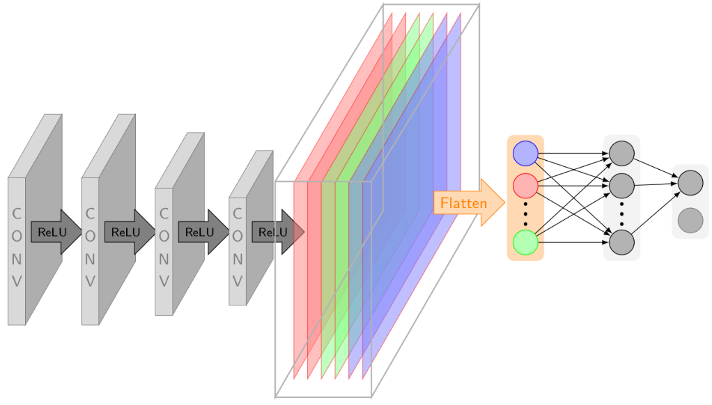
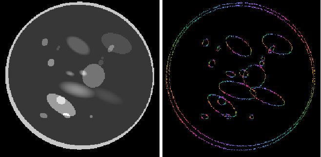
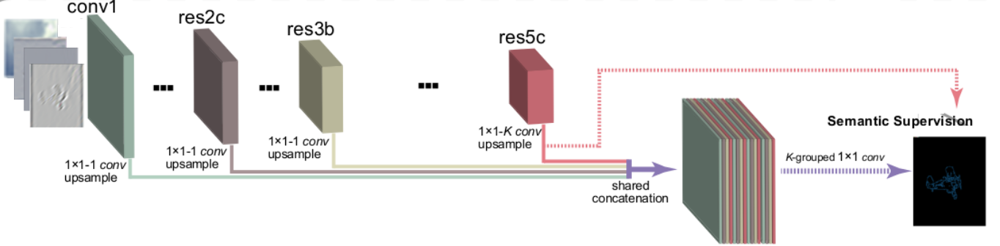
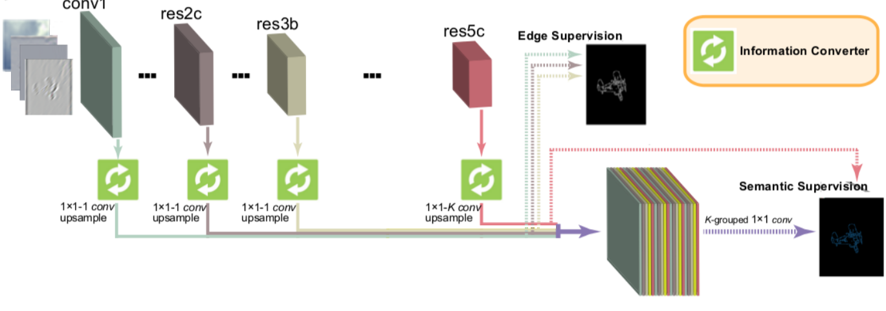
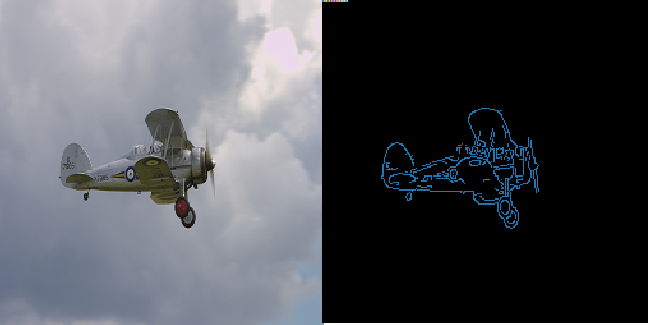

# ShearSED: Shearlet Semantic Edge Detection

By H. Andrade-Loarca, G. Kutyniok, O. Öktem

### License

ShearSED is released under the MIT License (refer to the LICENSE file for details).

### Contents
0. [Introduction](#introduction)
0. [Citation](#citation)
0. [Requirements](#requirements)
0. [Installation](#installation)
0. [Usage](#usage)
0. [References](#references)
0. [Contact](#contact)

### Introduction

This repository contains the entire pipline (including data preprocessing, training, testing, evaluation and visualization) for **ShearSED**.

ShearSED is a recently proposed set techniques which which involved model-based and data-driven approaches for high-performance semantic edge detection. This method uses the optimal edge representation in images provided by [Shearlets](/www.shearlab.org) and the highly specilized and accurate classification capabilities of deep convolutional neural networks. For more details, please refere to the [arXiv technical report](https://arxiv.org/abs/1911.12159).

This work makes use of three different architectures, the first architecture uses a simple 4-layered CNN, also known as the [DeNSE architecture](https://epubs.siam.org/doi/abs/10.1137/19M1237594), to extract the Wavefront set of an image. The method proposed earlier this year by the authors, DeNSE achieves state-of-the-art edge orientation extraction performance on the [Semantic Boundaries Dataset](http://home.bharathh.info/pubs/codes/SBD/download.html) and the [Berkeley Segmentation Dataset](https://www2.eecs.berkeley.edu/Research/Projects/CS/vision/bsds/), as well as other toy dataset with phatoms formed by ellipses which resembles human-head phantoms (e.g. Shepp-Logan phantom). 

The other architectures, namely, ShearCASENet and ShearDDS, are able to perform semantic edge detection. This architectures use as the backbone the [CASENet](https://arxiv.org/abs/1705.09759) and [DDS](https://arxiv.org/abs/1804.02864), but they take as input the shearlet coefficients of the image and it does not make use of the buffer layer of the original architectures. 

This method can be used for different applications in image processing and computer vision (e.g. edge/corner detection and tracking) as well as inverse problems regularization (e.g. Wavefront set reconstrucion in Computed Tomography).

### Citation

If you find **ShearSED** useful in your research, please consider to cite the following papers:

	@inproceedings{andrade2019sed, 
	  title={Shearlets as Feature Extractor for Semantic Edge Detection: The Model-Based and Data-Driven Realm}, 
	  author={Andrade-Loarca, Hector, Kutyiniok, Gitta, Öktem, Ozan},
	  booktitle={arXiv preprint: arXiv:1911.12159}, 
	  year={2019}
	}

### Requirements

### Installation

### Usage

### References

### Contact

[Hector Andrade-Loarca](https://arsenal9971.github.io/)

  Questions can also be left as issues in the repository. We will be happy to answer them.
